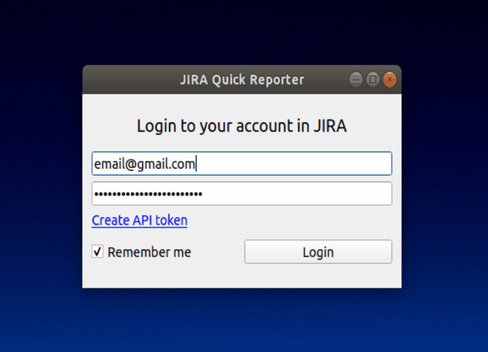

# JIRA Quick Reporter
[](https://github.com/sphericalpm/jira-quick-reporter/blob/master/LICENSE)


JIRA Quick Reporter (JQR, pronounced "zheeker") is a desktop application that helps automate your time management and reporting.

With JQR you can simply manage your issues, workflow, spent time, etc.
&nbsp;


### Brief description of the JQR functionality:
------------
JIRA Quick Reporter has the following features:
* Authentification window (you can login with Jira token. There you can find a link for token creation)
* Main window with list of your issues (default). Main window contains filters, workflow dropdown, pomodoro timer, log work
* Wokflow window (you can change ticket status and add detail information about workflow change)
* Pomodoro timer window (you can start new pomodoro and log work from it. Has all classical pomodoro features).
* Log work window (you can simply log work use main window but also you can open Log work window and add detail information for you work).
* Filters on the main window (you can make advanced issue search for all possible projects in your company).



&nbsp;

### How to build an executable application:
------------
* First you should create pyenv based on your system version of python and activate it.

How to create pyenv:

https://github.com/pyenv/pyenv-installer

https://github.com/pyenv/pyenv-virtualenv

* Next you should install all the necessary libraries and dependencies:
```pip install -r requirements.txt```

* Then you should run build_app.py:
```python3 build_app.py```

You can find executable version of JQR in dist/JQR/JQR
&nbsp;

### How to work with filters:
-------------
On the main window you can see menu with a list of filters.
By default you have a 'my open issues' filter and 'Search issues' menu item.


#### Creating new filter
1. You need to click '+' button in menu or 'Search issues' menu item.

2. Then, in the text input you can write a query.

3. You can click the 'Search' button and see results of the query.

4. To save filter, you need to click the 'Save as' button above the text input.


#### Editing a filter

1. You need to click 'filter_name' menu item.

Default query is 'assignee = currentUser() and resolution = unresolved'

2. Next you need to follow steps 2-3 from previous paragraph

3. To save edited filter, you need to click the 'Save' button above the text input.
    If you haven't edited a filter, the 'Save' button will be disabled.


#### How to delete a filter

You need to click right button on 'filter_name' menu item and then click 'Delete' in context menu.

You cannot delete default filter 'my open issues' and the 'Search issues' menu item.

#### Syntax help

Queries should be written in JQL.

Syntax help - https://confluence.atlassian.com/display/JIRASOFTWARECLOUD/Advanced+searching
&nbsp;


### Contacts
-------------

Maria Filonova: <mfilonova@spherical.pm>

Dayana Shcheglova: <dshcheglova@spherical.pm>
